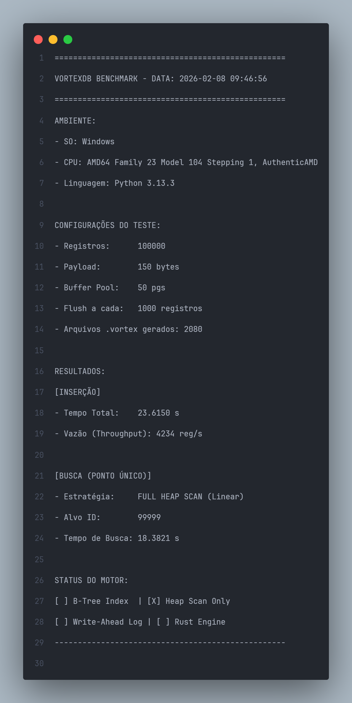
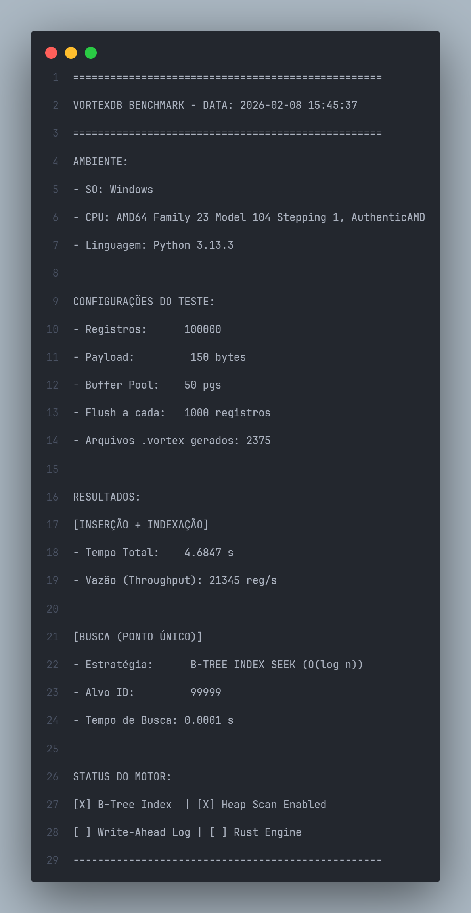

# 🌪️ VortexDB

**VortexDB** é uma engine de banco de dados experimental projetada para latência ultra-baixa e eficiência máxima de I/O. O projeto nasceu da frustração com abstrações pesadas de alto nível, com o objetivo de criar um "vórtice" onde os dados fluem na velocidade do metal.

> 🛠️ **Status:** Early Development (Prototipando em Python / Migrando para Rust)
## 🏗️ Roadmap de Arquitetura
* [x] **Phase 1 (Python):** Validação de algoritmos, estruturas de dados e lógica de indexação.
* [ ] **Phase 2 (Rust - Current):** Reescrita do core, gerenciamento manual de memória e segurança de concorrência.
* [ ] **Phase 3 (Network):** Implementação de protocolo binário próprio para comunicação cliente-servidor.
      
---

## 🚀 O Diferencial
O VortexDB não tenta ser um canivete suíço. Ele é focado no que importa para performance:
* **Storage Engine Customizada:** Zero arquivos de texto. O Vortex manipula bytes diretamente no disco.
* **In-Memory First:** Arquitetura otimizada para operações em memória com persistência assíncrona.
* **Performance-Driven:** Evoluindo de um protótipo em Python para uma engine de alto desempenho escrita em **Rust**, focando em *Zero-copy* e *Lock-free concurrency*.

## 📜 Especificação do Formato `.vortex`
Para garantir que o acesso ao disco seja previsível e atômico, o Vortex utiliza um layout de **Slotted Pages** com páginas de **4KB**.

## 🎯 Objetivo do Projeto
Este projeto foi iniciado principalmente para o estudo profundo de funcionamento de bancos de dados relacionais e sistemas de baixo nível. No entanto, a pretensão é evoluir o VortexDB para que se torne uma opção viável, rápida e leve para projetos reais que demandam controle total sobre a persistência de dados.

## 🤝 Contribuição
Se você gosta de escovar bits e não tem medo de ponteiros, *locks* e gerenciamento de memória no braço, sinta-se em casa para contribuir.

## 📊 Benchmarks & Performance
O VortexDB é testado rigorosamente sob estresse para garantir que a evolução da arquitetura reflita em ganhos reais de velocidade. Mantemos um histórico detalhado de performance para rastrear regressões e vitórias algorítmicas.

> 📂 **Histórico Completo:** Os logs detalhados de cada rodada podem ser encontrados em [`benchmarks/benchmark_results.txt`](./benchmarks/benchmark_results.txt).

### ⚡ Último Resultado: B+Tree Seek vs. Full Heap Scan
Neste teste de estresse com **100.000 registros**, comparamos a eficiência da nova implementação de busca indexada (O(log n)) contra a varredura linear original (O(n)).

| Métrica | Full Heap Scan (Linear) | B+Tree Index Seek | Ganho |
| :--- | :--- | :--- | :--- |
| **Tempo de Busca** | 18.3821 s | **0.0001 s** | **~180.000x** |
| **Throughput (Escrita)** | 4,234 reg/s | **21,345 reg/s** | **5x** |

#### Evidências Técnicas:
Abaixo, as capturas dos benchmarks demonstrando a diferença brutal de performance após a implementação da B+Tree e a otimização do Buffer Manager:

**1. Baseline (Sem Índice - Apenas Heap Scan):**

**2. Otimizado (Com B+Tree Index + RAM Buffer):**

*Nota: O ganho em escrita (Throughput) deve-se à refatoração do Buffer Manager, que reduziu o overhead de I/O síncrono no disco.*

Projeto feito principalmente para o aprendizado de funcionamento de banco de dados relacionais, mas com pretenção de se tornar uma opção em projetos.
